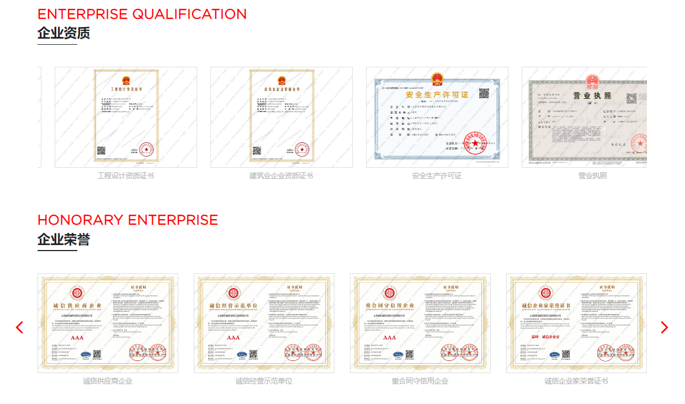



上海现代办公设计有限公司，作为中国领先的办公空间设计和解决方案提供商，我们深信，每一个成功的企业背后都有一个强大的企业文化作为支撑。我们的企业文化不仅是我们公司发展的灵魂，也是我们与客户建立长期合作关系的基石。

首先，我们坚信“以人为本”。我们认为，员工是公司最宝贵的资产，他们的创造力、专业能力和团队精神是推动公司持续发展的动力。因此，我们致力于为员工提供一个开放、包容、充满挑战的工作环境，鼓励他们不断学习、创新和发展。

其次，我们倡导“创新求变”。在这个快速变化的时代，我们深知只有不断创新才能保持竞争力。我们鼓励员工打破常规，挑战现状，寻求更好的解决方案。我们相信，通过不断的创新和改进，我们可以为客户创造更大的价值。

再次，我们追求“卓越服务”。我们始终以客户需求为导向，努力提供优质的产品和服务。我们深知，只有超越客户的期待，才能赢得客户的信任和忠诚。因此，我们始终坚持高质量的标准，不断提升我们的专业能力和服务水平。

最后，我们坚持“可持续发展”。我们深知，作为一个负责任的企业，我们需要对社会和环境负责。我们承诺，在追求经济效益的同时，也要关注社会效益和环境效益。我们致力于使用环保材料，减少能耗，保护环境，为构建一个更加美好的世界贡献我们的力量。

总的来说，上海现代办公设计有限公司的企业文化是以人为本、创新求变、追求卓越服务和坚持可持续发展。我们希望通过这些核心价值观，引导我们的行为，推动我们的成长，实现我们的使命——为客户提供最佳的办公空间解决方案，为社会创造更大的价值。